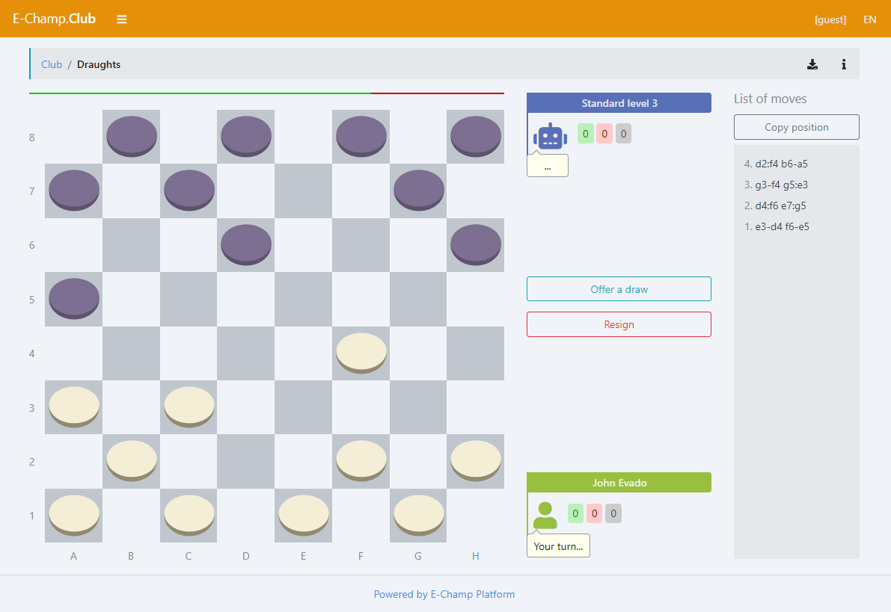

# Checkers Online Multiplayer Game
A logical, server-side app for browser online games

Game bots can be used both instead of and together with online opponents.

### Screenshot

[]

## Docker installation

Clone application to `/app`
```sh
cd /app
docker-compose up -d mongo
docker-compose up --build installer
docker-compose up -d server
```

## Typical installation

#### Install environment
- [Node.js](https://nodejs.org) (version 16)
- [MongoDB](https://www.mongodb.com/download-center/community) (version 5)

#### Linux
Clone application to `/app`
```sh
cd /app
npm install
NODE_ENV=development node console/install
NODE_ENV=development node console/start
```

#### Windows
Clone application to `c:/app`
```sh
cd c:/app
npm install
set NODE_ENV=development
node console/install
node console/start
```

## Usage

Web interface `http://localhost:3000`

